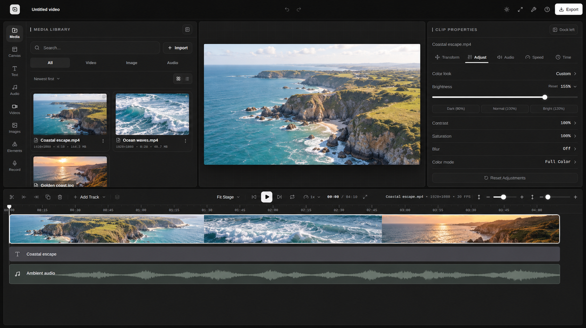

<p align="center">
  <picture>
    <source media="(prefers-color-scheme: dark)" srcset="public/brand/cutnora-logo-dark.svg">
    
  </picture>
</p>

<h1 align="center">Cutnora</h1>

<h3 align="center">Local-first Video Editor, Multi-track Timeline &amp; Browser Export</h3>

<p align="center">
  
  
  
  
  
  <br>
  
  
  
  <a href="LICENSE"></a>
</p>

<p align="center">
  <a href="#run-locally">Get started</a> ·
  <a href="#what-you-can-create">Features</a> ·
  <a href="CONTRIBUTING.md">Contribute</a> ·
  <a href="https://github.com/kuldeeprajput-dev/cutnora/issues">Issues</a>
</p>

---

<p align="center">
  Edit video, images, text, and audio on a multi-track timeline.<br>
  Trim clips, arrange layers, adjust visuals and sound, and export to MP4 or WebM where supported.
</p>

<p align="center"><strong>Media processing happens on your device. Projects are saved in your browser.</strong></p>

## Editor preview

<p align="center">
  
</p>

<p align="center"><sub>Edited screenshot with illustrative sample media.</sub></p>

## What you can create

- **Timeline editing** — trim, split, duplicate, and arrange clips across multiple tracks.
- **Canvas layers** — combine video, images, text, and elements; adjust position, size, rotation, and opacity.
- **Visual adjustments** — change brightness, contrast, saturation, and blur.
- **Audio and voiceovers** — add audio, adjust volume, change clip speed, or record your microphone.
- **Screen and camera recordings** — capture directly in the editor where your browser supports it.
- **Video export** — choose MP4 or WebM, resolution, frame rate, and quality according to browser support.

## Your first video

1. **Create a project.** Choose a canvas size for your video.
2. **Add your media.** Import files and place them on the timeline.
3. **Make it yours.** Arrange clips, add text or audio, and preview your changes.
4. **Export.** Choose your settings and keep the tab open until your video is ready.

### Local storage and browser support

- **Storage is local.** Projects do not automatically sync between browsers or devices. Clearing browser site data can remove your projects and media, so keep your original files and export finished work.
- **Browser support matters.** Available codecs, recording options, and export performance depend on your browser and device. Export offers 24, 30, and 60 fps; compatibility paths may deliver a lower frame rate.
- **Some assets use the internet.** Built-in asset libraries may fetch content from external services. Imported files are processed on your device.

## Run locally

### 1. Install the prerequisites

Install [Git](https://git-scm.com/downloads) and [Node.js 24](https://nodejs.org/en/download). Cutnora uses **pnpm 11.20.0**.

If you don't already have pnpm, install it after Node.js:

```bash
npm install --global pnpm@11.20.0
```

### 2. Clone and start

```bash
git clone https://github.com/kuldeeprajput-dev/cutnora.git
cd cutnora
pnpm install --frozen-lockfile
pnpm dev
```

### 3. Start editing

Open **[localhost:3000](http://localhost:3000)**, create a project, and import your media. Keep the terminal running while you use the app. Press `Ctrl+C` to stop the server.

<details>
<summary><strong>Development and production commands</strong></summary>

- `pnpm dev` — start the development server.
- `pnpm build` — create a production build.
- `pnpm start` — serve that build; run `pnpm build` first.
- `pnpm lint` — check code with ESLint.
- `pnpm typecheck` — check TypeScript types.
- `pnpm format:check` — check formatting without changing files.

Read [CONTRIBUTING.md](CONTRIBUTING.md) for contribution checks and pull request guidance.

</details>

## Under the hood

Built with Next.js, React, TypeScript, and Tailwind CSS. Zustand manages editor state; Dexie and browser file storage keep projects and media local. Mediabunny and browser media APIs handle decoding and export, with MediaRecorder and FFmpeg compatibility paths.

## Contribute and get help

Bug reports, documentation, accessibility fixes, and focused editor improvements are welcome.

- [Open an issue](https://github.com/kuldeeprajput-dev/cutnora/issues) to report a bug or suggest a feature.
- Read the [contribution guide](CONTRIBUTING.md) before submitting a pull request.
- Follow the [Code of Conduct](CODE_OF_CONDUCT.md) in project discussions.
- Report vulnerabilities privately using [SECURITY.md](SECURITY.md).

## License

Cutnora's original code is available under the [MIT License](LICENSE). Third-party dependencies and assets retain their own licenses.

Copyright © 2026 [Kuldeep Rajput](https://github.com/kuldeeprajput-dev).
